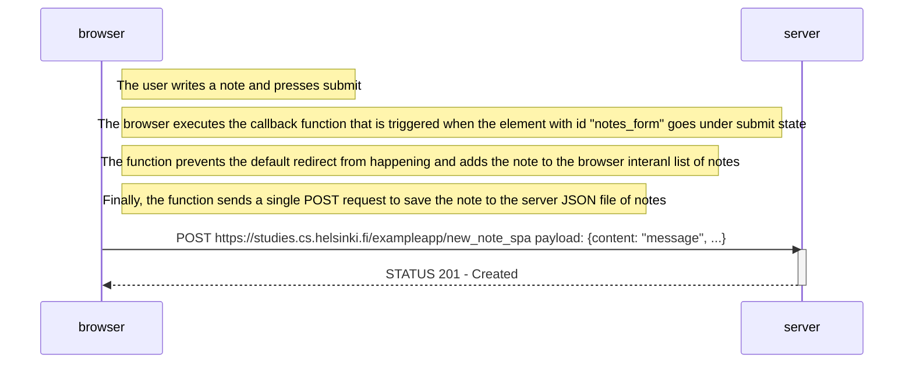

```mermaid
sequenceDiagram
    participant browser
    participant server

    Note right of browser: The user writes a note and presses submit

    Note right of browser: The browser executes the callback function that is triggered when the element with id "notes_form" goes under submit state

    Note right of browser: The function prevents the default redirect from happening and adds the note to the browser interanl list of notes

    Note right of browser: Finally, the function sends a single POST request to save the note to the server JSON file of notes
    
    browser->>server: POST https://studies.cs.helsinki.fi/exampleapp/new_note_spa payload: {content: "message", ...}
    activate server
    server-->>browser: STATUS 201 - Created
    deactivate server
```